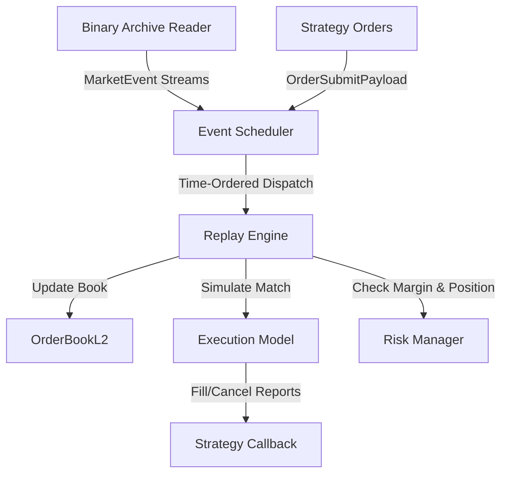

# C++ Backtesting Engine (`m5_engine`)
## Developer Reference & Tutorial Guide

This guide describes the design, matching engine logic, latency simulation, risk control modules, and step-by-step usage of the C++20 `m5_engine` backtesting simulator (exposed to Python via `pybind11`).

## 1. Event Replay and Kline Backtests

Most crypto backtesters replay 1-minute or 1-hour OHLCV candles (klines). Bar data does not capture:
* **Queue Dynamics**: If the price touches your limit order, does it fill? In reality, you are placed at the back of the queue, and the price might bounce before depleting the volume ahead of you.
* **Network Latencies**: When your strategy emits an order, it takes time (e.g., 30-50ms) to reach the exchange. By the time it arrives, the order book state has changed.
* **Slippage & Slippage Depth**: Large market orders cannot fill at the best bid/ask. They must walk the book levels, incurring size-dependent slippage.
* **Execution Timings (TIFs)**: Time-In-Force options like Immediate-or-Cancel (IOC) and Fill-or-Kill (FOK) depend on matching state exactly at the arrival timestamp.

`m5_engine` is a simulator that replays tick-level market trades and L2 order book updates chronologically, enforcing network delays, jitter, queue position estimates, fee schedules, and real-time margin risk controls.

## 2. Architecture & Data Flow



### Components:
1. **BinaryArchiveReader**: Reads normalized `.bin` files (`CREARCHV` format) containing timestamped `DEPTH_SNAPSHOT`, `DEPTH_DIFF`, `PUBLIC_TRADE`, and `FUNDING_RATE` events.
2. **EventScheduler**: A min-heap queue that merges multiple market data streams and strategy execution/cancellation requests in timestamp order.
3. **OrderBookL2**: Maintains the bid/ask price levels. Implements crossed-book checks and market-order LOB walks.
4. **ExecutionModel**: The simulator matching engine. Simulates order submission latency, jitter, queue decay, partial fills, cancellation latency, and TIF/Post-Only rules.
5. **RiskManager**: Tracks account balance, open orders, positions, realized/unrealized P&L, initial/maintenance margin, and performs auto-liquidation.

## 3. Execution & Matching Mechanics

### 3.1. Network Latency & Jitter Simulation
When an order is submitted:
$$\text{Arrival Timestamp} = t_{\text{current}} + \text{Submission Latency} + \epsilon$$
Where $\epsilon \sim U(-\text{Jitter}, +\text{Jitter})$ is a deterministic pseudo-random variable generated using `std::mt19937_64` (fully reproducible using a configurable RNG seed).

For order cancellations, a **cancellation latency** (e.g., 30ms) is applied:
$$\text{Cancellation Effective Timestamp} = t_{\text{cancel\_requested}} + \text{Cancellation Latency}$$
During this 30ms window, the order remains active in the matching pool and can still be filled (cancellation race condition).

### 3.2. Order Book Walk (Slippage)
Market orders walk the L2 book levels to compute execution price. The engine fetches bids/asks chronologically until the target quantity is satisfied:
$$\text{Execution VWAP} = \frac{\sum (p_i \times q_i)}{\sum q_i}$$
If the LOB is depleted before satisfying the quantity, the remaining order portion is filled at the last level's price (conservative estimate) or cancelled based on TIF.

### 3.3. Queue Position Estimation
When a limit order is placed at an existing price level, its initial queue position is:
$$\text{Queue Position} = \text{Displayed Volume at Level} \times \text{Initial Depth Fraction}$$
If placed at a price-improving level (above best bid / below best ask), it gets:
$$\text{Queue Position} = 0 \text{ (front of queue)}$$
As public trades occur at that level, the queue position is depleted:
$$\Delta \text{Queue Position} = -\text{Trade Qty} \times \text{Depletion Rate}$$
Additionally, a **cancellation decay** is applied per event to model other market participants pulling their orders:
$$\text{Queue Position}_{t} = \text{Queue Position}_{t-1} \times \text{Cancel Decay}$$
When $\text{Queue Position} \le 0$, the order begins filling.

### 3.4. Time-In-Force (TIF) and Post-Only
* **GTC (Good 'Til Cancelled)**: Standard resting order.
* **IOC (Immediate-or-Cancel)**: Crosses the book immediately on activation. Any unfilled remainder is cancelled.
* **FOK (Fill-or-Kill)**: Crosses the book. If the entire order quantity cannot be filled immediately, the whole order is killed (rejected) with 0 fills.
* **LIMIT_MAKER (Post-Only)**: Resting order. If it would cross the spread immediately on activation, it is rejected so accepted resting orders can receive maker treatment.

## 4. Risk, Fees, and Liquidation

### 4.1. Fee Schedule
Fees are calculated per-fill using the registered symbol parameters:
$$\text{Fee} = \left(\frac{\text{Price} \times \text{Quantity}}{\text{qty\_scale}}\right) \times \frac{\text{Fee Bps}}{100,000}$$
The engine chooses `maker_fee_bps` or `taker_fee_bps` depending on whether the order was matched as maker or taker.

### 4.2. Margins and Leverage
* **Initial Margin (IM)**: Required to place/activate an order:
  $$\text{IM} = \frac{\text{Notional}}{\text{Leverage}}$$
* **Maintenance Margin (MM)**: Minimum equity required to hold a position:
  $$\text{MM} = \frac{\text{Notional}}{2 \times \text{Leverage}}$$
* **Equity**:
  $$\text{Equity} = \text{Balance} + \text{Realized P&L} + \text{Unrealized P&L}$$

### 4.3. Liquidation Engine
If $\text{Equity} < \text{Total MM}$, a margin breach occurs. The liquidation engine:
1. Marks the account `is_liquidated = true`.
2. Cancels all active orders immediately.
3. Force-closes all open positions (resets quantity to 0) at the current mark price.
4. Updates realized P&L to reflect position closeout.

## 5. C++ Class Interfaces

### `SimulatedOrder` (`execution_model.hpp`)
```cpp
struct SimulatedOrder {
    uint64_t   order_id;
    uint16_t   symbol_id;
    Side       side;
    FixedPoint price;
    FixedPoint qty;
    FixedPoint filled_qty;
    FixedPoint queue_position;
    int64_t    submit_ts;
    int64_t    activate_ts;
    int64_t    cancel_activate_ts;
    bool       is_active;
    bool       is_filled;
    bool       is_cancelled;
    bool       pending_cancel;
    bool       is_maker;
    OrderType  type;
    TimeInForce tif;
};
```

## 6. Writing and Running a Python Strategy

The following example shows a strategy and replay runner using `m5_engine`.

### 6.1. The Strategy File (`my_strategy.py`)
```python
import m5_engine as qe

class RealisticMarketMaker(qe.Strategy):
    def __init__(self, engine, symbol_id):
        super().__init__()
        self.engine = engine
        self.symbol_id = symbol_id
        self.next_order_id = 1

        # State
        self.active_bid_id = None
        self.active_ask_id = None

    def on_market_event(self, event, book):
        # We only act on order book updates
        if event.type not in (qe.EventType.DEPTH_SNAPSHOT, qe.EventType.DEPTH_DIFF):
            return

        best_bid = book.get_best_bid()
        best_ask = book.get_best_ask()

        if best_bid <= 0 or best_ask <= 0:
            return

        # Quote two ticks outside the current best bid and ask.
        target_bid = best_bid - 2
        target_ask = best_ask + 2

        current_ts = event.exchange_ts

        # Check if we need to quote bid
        if self.active_bid_id is None:
            self.active_bid_id = self.next_order_id
            self.next_order_id += 1

            o = qe.OrderSubmitPayload()
            o.order_id = self.active_bid_id
            o.side = qe.Side.BUY
            o.price = target_bid
            o.qty = 100  # 0.1 BTC (scale 1000)
            o.type = qe.OrderType.LIMIT
            o.tif = qe.TimeInForce.GTC

            self.engine.submit_order(o, self.symbol_id, current_ts)

        # Check if we need to quote ask
        if self.active_ask_id is None:
            self.active_ask_id = self.next_order_id
            self.next_order_id += 1

            o = qe.OrderSubmitPayload()
            o.order_id = self.active_ask_id
            o.side = qe.Side.SELL
            o.price = target_ask
            o.qty = 100
            o.type = qe.OrderType.LIMIT
            o.tif = qe.TimeInForce.GTC

            self.engine.submit_order(o, self.symbol_id, current_ts)

    def on_fill(self, fill, symbol_id):
        print(f"[FILL] Order {fill.order_id} filled {fill.fill_qty} @ {fill.fill_price}. Side: {fill.side}")
        if fill.order_id == self.active_bid_id:
            self.active_bid_id = None
        elif fill.order_id == self.active_ask_id:
            self.active_ask_id = None
```

### 6.2. The Backtest Runner (`run_backtest.py`)
```python
import m5_engine as qe
from my_strategy import RealisticMarketMaker

# 1. Initialize Symbol Meta and Registry
registry = qe.SymbolRegistry()
btc_meta = qe.SymbolMeta()
btc_meta.symbol_id = 0
btc_meta.symbol_name = "BTCUSDT"
btc_meta.price_scale = 100    # prices multiplied by 100
btc_meta.qty_scale = 1000     # quantities multiplied by 1000
btc_meta.tick_size = 1
btc_meta.lot_size = 1
btc_meta.maker_fee_bps = 2    # 0.02% VIP tier
btc_meta.taker_fee_bps = 5    # 0.05% VIP tier
registry.register_symbol(btc_meta)

# 2. Configure execution parameters
lat_config = qe.LatencyConfig()
lat_config.submission_ns = 25_000_000     # 25ms one-way wire time
lat_config.cancellation_ns = 30_000_000   # 30ms cancel RTT
lat_config.jitter_ns = 5_000_000          # +/-5ms jitter
lat_config.rng_seed = 12345                # Seed for deterministic jitter

queue_config = qe.QueueConfig()
queue_config.depletion_rate = 0.75        # 75% of public trades deplete our queue
queue_config.cancel_decay_per_event = 0.998
queue_config.initial_depth_fraction = 1.0  # Conservative: start at back of book level

risk_limits = qe.RiskLimits()
risk_limits.max_gross_exposure = 50_000_00 # Max $50,000 gross notional
risk_limits.max_open_orders = 10

# 3. Create the Replay Engine with $1,000 initial balance
engine = qe.ReplayEngine(registry, lat_config, queue_config, risk_limits, 1000_00)

# 4. Attach Strategy
strategy = RealisticMarketMaker(engine, symbol_id=0)
engine.set_strategy(strategy)

# 5. Load Binary Tick Archive and Run
reader = qe.BinaryArchiveReader("data/normalized/BTCUSDT-2025-01-15.bin")
engine.add_stream(reader)
engine.run()

# 6. Analyze Results
risk = engine.risk()
stats = engine.stats()
print("--- Backtest Completed ---")
print(f"Total processed events: {stats.events_processed:,}")
print(f"Total fills: {stats.fill_events}")
print(f"Account Balance: ${risk.account_state().balance / 100:.2f} USDT")
print(f"Realized P&L: ${risk.total_realized_pnl() / 100:.2f} USDT")
print(f"Unrealized P&L: ${risk.total_unrealized_pnl() / 100:.2f} USDT")
print(f"Is Liquidated: {risk.account_state().is_liquidated}")
```

## 7. Performance Guidelines

* **Batch Mode**: If your strategy does not require order book state checks for every trade, enable batch mode (`engine.set_batch_mode(True)`). This batches events inside Python to minimize GIL overhead.
* **Deterministic Runs**: Replaying the same binary archive twice with the same `rng_seed` should produce matching fills and P&L; verify this for the strategy and data used.
* **Avoid Pandas inside Callbacks**: Do not execute heavy operations (e.g. DataFrame merges) inside `on_market_event()`. Instead, maintain small local variables or NumPy arrays, updating them incrementally.
